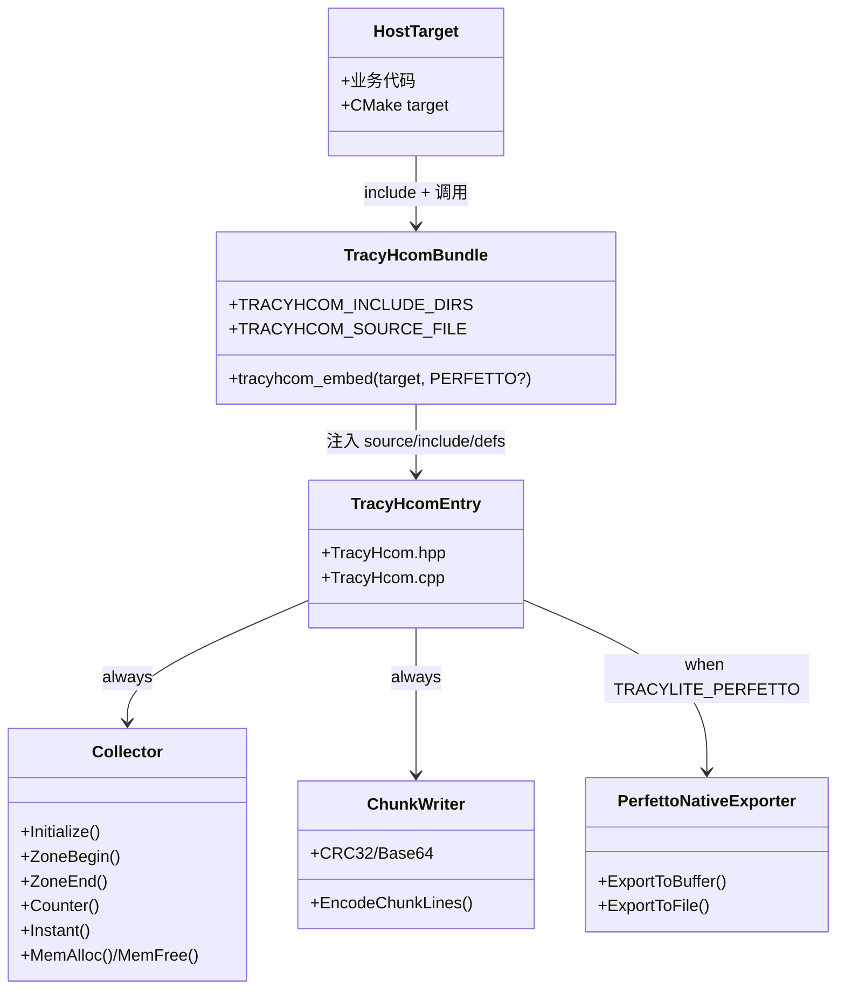
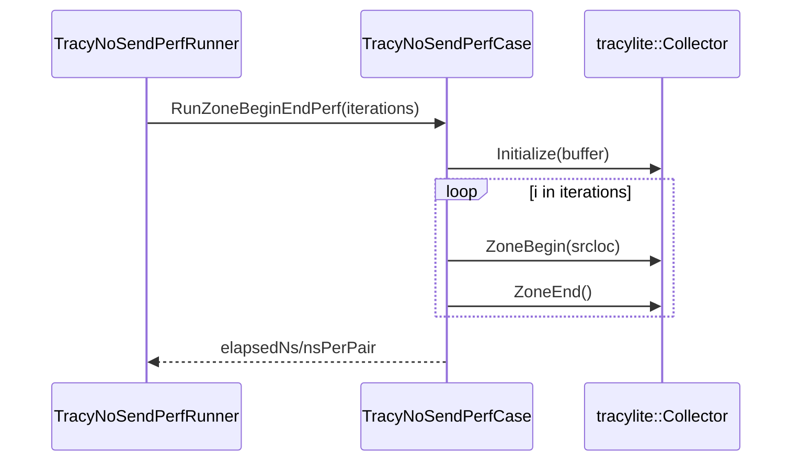
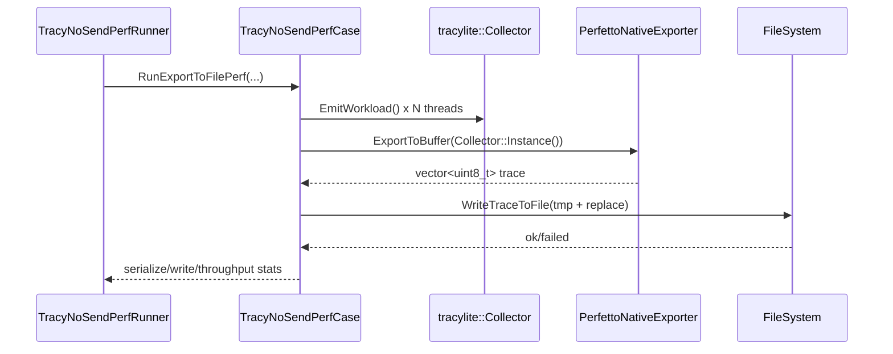
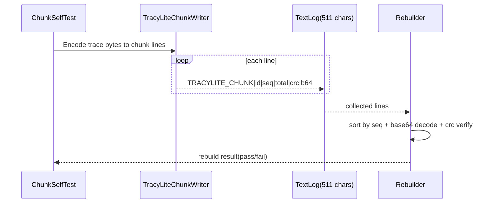

# HComm 重构归档（SRSSD）

> 归档日期：2026-05-17  
> 适用分支：`tracy-hcomm-0-13-1`  
> 范围：`tracy_hcom/` 便携集成路径（Route A）+ `examples/NoSendPerf` 直集成用例

---

## 1. 背景与目标（SRS）

### 1.1 背景
本次下午重构目标是将 HComm 能力从“依赖完整 TracyClient 目标链接”收敛为“可直接嵌入宿主目标的便携源码包”，并保留：
- Core collection（`TracyLiteAll`）
- Perfetto 导出（`TracyLitePerfetto`）
- 文本分片传输（`TracyLiteChunkWriter`）

### 1.2 目标
1. 形成可投放的 `tracy_hcom/` 单目录集成包（Route A）。
2. 宿主通过 `target_sources` 直接编译 `TracyHcom.cpp`，不要求单独预编译库。
3. 提供明确的特性门控（Perfetto 开关）。
4. 在示例中给出“直接集成 HComm 代码”的可构建样例。

### 1.3 非目标
- 本阶段不做 phase-two 的 `TracyProfiler.hpp` 完全解耦。
- 不构建 mirror tree，不复制上游 Tracy 源树。

---

## 2. 约束与设计决策（SSD）

### 2.1 关键约束
- CMake Route A：`target_sources + target_include_directories`。
- 宿主需提供：
  - `TRACY_ROOT`
  - `TRACY_HCOM_DIR`（缺省可推导为 `${TRACY_ROOT}/tracy_hcom`）
- Perfetto 模式需可解析 `perfetto.h`。

### 2.2 关键决策
- 采用单 TU 入口：`tracy_hcom/TracyHcom.cpp`。
- 通过 `TracyHcomBundle.cmake` 封装接入动作 `tracyhcom_embed(<target> [PERFETTO])`。
- Header 暴露最小接口：`TracyHcom.hpp` + `TracyHcomConfig.hpp` + `TracyHcomApi.h`。

---

## 3. 文件结构（结构视图）

### 3.1 HComm 目录

```text
tracy_hcom/
├─ TracyHcom.cpp              # 单 TU 实现入口
├─ TracyHcom.hpp              # 外部最小入口头
├─ TracyHcomConfig.hpp        # 特性开关映射
├─ TracyHcomApi.h             # 导出/导入宏
├─ TracyHcomBundle.cmake      # Route A 集成助手
├─ TracyHcomStubs.cpp         # phase-one stub（替代部分 TracyProfiler 提供符号）
└─ README.md                  # 集成说明
```

### 3.2 与上游 Tracy 依赖关系（源级）

`TracyHcom.cpp` 通过 include 直接汇聚上游模块：
- `public/client/tracy_rpmalloc.cpp`
- `public/client/TracyAlloc.cpp`
- `public/client/TracyLiteAll.cpp`
- `public/common/TracySystem.cpp`
- `public/client/TracyLitePerfetto.cpp`（`TRACYLITE_PERFETTO` 时）

---

## 4. 模块/类间结构（逻辑视图）

## 4.1 公开模块关系



### 4.2 示例层结构（NoSendPerf）

- `TracyNoSendPerfRunner`：测试驱动入口（zone/export/chunk）。
- `TracyNoSendPerfCase`：封装 workload 生成、导出、分片自测。
- HComm 直集成目标：
  - `TracyHcomCoreOnly`（不启用 Perfetto）
  - `TracyHcomCase`（启用 Perfetto）

---

## 5. 时序图（行为视图）

### 5.1 Zone 采集流程



### 5.2 Perfetto 导出流程（启用 TRACYLITE_PERFETTO）



### 5.3 文本分片传输与重组流程



---

## 6. 构建与集成方式（实施视图）

### 6.1 宿主 CMake 最小接入

```cmake
set(TRACY_ROOT "<path-to-tracy>")
set(TRACY_HCOM_DIR "${TRACY_ROOT}/tracy_hcom")
include("${TRACY_HCOM_DIR}/TracyHcomBundle.cmake")

add_library(MySo SHARED ...)
tracyhcom_embed(MySo)          # core-only
# tracyhcom_embed(MySo PERFETTO) # 如需 Perfetto
```

### 6.2 实际编译定义（由 bundle 注入）
- `TRACY_ENABLE=1`
- `TRACY_SAVE_NO_SEND=1`
- `TRACY_ON_DEMAND=1`
- `TRACY_NO_BROADCAST=1`
- `TRACY_ONLY_LOCALHOST=1`
- `TRACY_NO_SAMPLING=1`
- `TRACY_NO_CONTEXT_SWITCH=1`
- Perfetto 时额外：`TRACYHCOM_ENABLE_PERFETTO=1`, `TRACYLITE_PERFETTO=1`

---

## 7. 用例改造现状（示例视图）

`examples/NoSendPerf/CMakeLists.txt` 当前同时保留两类路径：
1. 传统路径：`TracyNoSendPerfCase`（编译 `TracyClient.cpp + TracyLitePerfetto.cpp`）
2. HComm 直集成路径：
   - `TracyHcomCoreOnly` + `TracyHcomCoreRunner`
   - `TracyHcomCase` + `TracyHcomRunner`

这满足“示例可直接集成 HComm 代码，而不是依赖整包 TracyClient 目标”的要求。

---

## 8. 验证记录（V&V）

### 8.1 构建验证结论
- 默认 8 组 Windows 预设（configure + build）已完成。
- 在 x64 VS Dev 环境下通过，退出码 0。

### 8.2 HComm 关键验证点
- `TracyHcomRunner` 可构建。
- `TracyHcom.ZoneBeginEnd` / `TracyHcom.ExportSplit` / `TracyHcom.ChunkSelfTest` 可作为回归点。

---

## 9. 后续阶段建议

1. phase-two：用 `TracyHcomTime.hpp` 替换当前对 `TracyProfiler.hpp` 的残余依赖。
2. 补充跨平台（Linux/WSL2）等价验证矩阵。
3. 在归档目录中追加一次“外部项目落地接入实例”链接（目标仓库级）。

---

## 10. 归档清单

- 结构与集成核心：`tracy_hcom/*`
- 示例验证入口：`examples/NoSendPerf/*`
- 本文档：`docs/HComm_SRSSD_Refactor_Archive_2026-05-17.md`

# HComm 归档记录

## 归档版本
- ArchiveVersion: HCOMM-ARCHIVE-2026.05.17-01
- Branch: tracy-hcomm-0-13-1
- CommitRange: N/A（当前归档基于本地工作区改动，尚未提交时可留空或后补）
- ArchiveDate: 2026-05-17
- Owner: cl193 / TracyLite-HComm

## 本次目标
- 完成 HComm 下午重构归档，并提供“直接集成 hcomm 代码（不依赖完整 TracyClient target）”的可编译示例与集成说明。

## 变更范围（文件/模块）
- tracy_hcom/
  - TracyHcom.cpp
  - TracyHcom.hpp
  - TracyHcomConfig.hpp
  - TracyHcomApi.h
  - TracyHcomBundle.cmake
  - README.md
- examples/NoSendPerf/
  - CMakeLists.txt
  - TracyNoSendPerfCase.cpp
- docs/
  - HComm_SRSSD_Refactor_Archive_2026-05-17.md

## 核心变更摘要
1. 新增并固化 Route A 便携集成模型：通过 `TracyHcomBundle.cmake` 将 `TracyHcom.cpp` 直接嵌入宿主目标。
2. 补齐 HComm 最小公开入口与配置门控：`TracyHcom.hpp` / `TracyHcomConfig.hpp` / `TracyHcomApi.h`。
3. 用例改造为双路径：保留传统 NoSendPerf 路径，同时新增 HComm 直集成路径（CoreOnly 与 Perfetto 两套）。
4. 文档归档完成：新增 SRSSD 风格归档文档，补充结构、模块关系与时序图；README 增加直接集成方法与验证命令。

## 行为/架构影响
- 文件结构变化：
  - 增加并稳定 `tracy_hcom/` 作为可投放 bundle 目录。
  - 增加 `docs/HComm_SRSSD_Refactor_Archive_2026-05-17.md` 作为归档文档。
- 模块关系变化：
  - 宿主不再需要“链接完整 TracyClient target”才能使用 HComm；
  - 通过 `tracyhcom_embed(<target> [PERFETTO])` 直接注入 source/include/defs。
- 时序变化：
  - Zone 采集、Perfetto 导出、Chunk 文本传输重组流程在归档文档中以 mermaid sequence diagram 固化。

## 兼容性说明
- 向后兼容：是（NoSendPerf 原路径保留）。
- 破坏性变更：无。
- 迁移要求：
  1. 设置 `TRACY_ROOT` 与（可选）`TRACY_HCOM_DIR`；
  2. `include(tracy_hcom/TracyHcomBundle.cmake)`；
  3. 在宿主 target 上调用 `tracyhcom_embed(target [PERFETTO])`；
  4. Perfetto 模式下确保 `perfetto.h` include 路径可用。

## 验证结果
- Build Presets:
  - Windows 默认 8 组 configure/build：PASS（x64 VS Dev 环境）
- Example Targets:
  - TracyHcomCoreRunner：PASS
  - TracyHcomRunner：PASS
- Tests:
  - CTest 用例（NoSendPerf/HComm 相关）可用；
  - VS Test Explorer 未发现同名测试（该部分为 CTest 风格，不是 Test Explorer 单测注册）。

## 风险与后续
- 已知风险：
  - phase-one 仍存在对 `TracyProfiler.hpp` 的残余依赖（通过 stub 过渡）。
- 后续计划：
  1. phase-two 引入 `TracyHcomTime.hpp`，进一步去除 `TracyProfiler.hpp` 依赖；
  2. 扩展 Linux/WSL2 同等验证矩阵；
  3. 归档补充外部项目接入样例链接。
